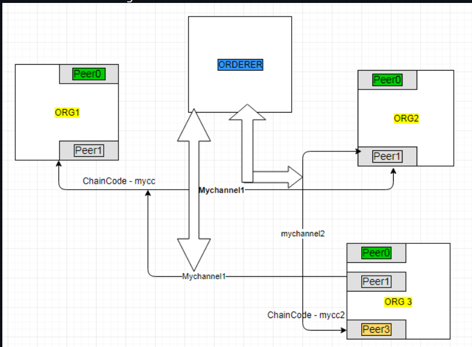

# Network Basics in Hyperledger Fabric

This document explains the basics of a Hyperledger Fabric network and how its core components work together.

---

## Types of Nodes in Hyperledger Fabric

Primarily uses three types of nodes:

1. **Orderer Node**
2. **Peer Node**
3. **Client Node**

---

## 1. Client Node

The client node acts as the interface between users and the blockchain network. It is not part of the blockchain itself but plays an essential role in interacting with it.

- Initiates transactions.

- Sends proposals (function calls) to peers for endorsement.

- Submits endorsed transactions to the orderer for consensus.

- Not part of the blockchain itself but acts as a gateway.

## 2. Peer Node

- Hosts the ledger and runs the  chaincode 

- 2 types: 
    1. **Endorsing power**: simulates transaction, signs results (endorsement)
    2. **committing power**: validates and commit blocks to ledger

each org typically has one peer 

Responsibilities: 
- endorse txn proposal 
- validate blocks to the orderer 
- update ledger state 

## 3. Orderer Node

- responsibilties for consensus and block creation 
- collect ecdoresed txn and order them into blokcs 
- deliever block to all peers in the channel 
i.e like a mailman that distributes 

order consensus: 
- total ordering of txn 
- no double spending (obv)
- consistency across peers

test network only uses one orderer node, 3f+1 is for orderer not peer nodes 

Network diagram of Fabric Network

---
