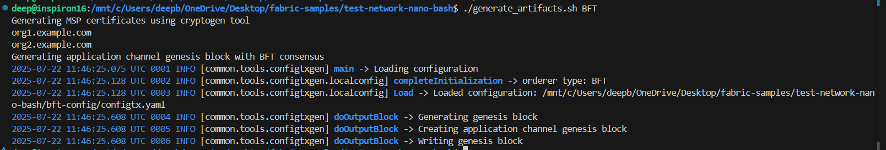
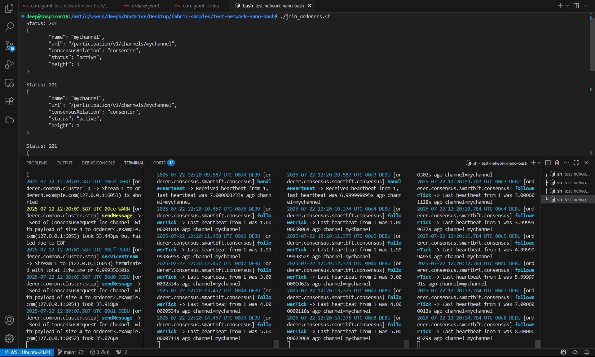
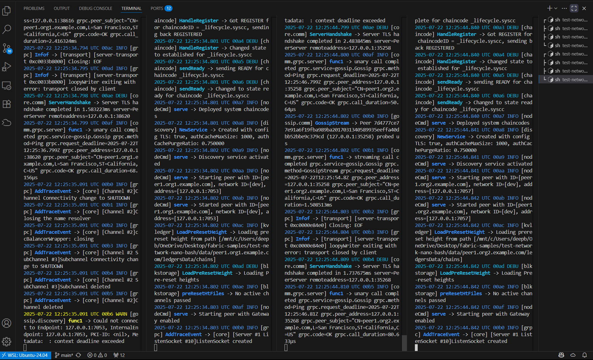

# Running Hyperledger Fabric Test Network - Nano Bash

## Prerequisites

Clone the [Fabric repo](https://github.com/BDLS-bft/fabric) and we must have to checkout the main branch to test SmartBFT. (Binaries will mostly cause an Issue while setting up the nano bash, so make sure to run latest binaries and not 2.5 or other binaries.)  


## 1. Configure External Builders

If you want to run chaincode as a service (without Docker), configure the peer to use the `ccaas` external builder.

- Edit `fabric-samples/config/core.yaml` as well as `fabric-samples/test-network-nano-bash/config/core.yaml` (around line 598):
  ```yaml
    externalBuilders:
    - name: golang
      path: /mnt/c/Users/deepb/OneDrive/Desktop/fabric-samples/test-network-nano-bash/external_builders/golang
      propagateEnvironment:
           - HOME   
    - name: node
      path: /mnt/c/Users/deepb/OneDrive/Desktop/fabric-samples/test-network-nano-bash/external_builders/node
      propagateEnvironment:
           - HOME
           - npm_config_cache
    - name: ccaas_builder
      path: /mnt/c/Users/deepb/OneDrive/Desktop/fabric-samples/test-network-nano-bash/builders/ccaas
      propagateEnvironment:
        - CHAINCODE_AS_A_SERVICE_BUILDER_CONFIG
  ```


## 2. Starting Network

-  run `./generate_artifacts.sh BFT` to generate crypto material (calls cryptogen) and application channel genesis block and configuration transactions (calls configtxgen). The artifacts will be created in the crypto-config and channel-artifacts directories.

- `fabric-samples/test-network-nano-bash/bft-config/configtx.yaml` This is the config file used


> **Note:** make sure to add the path to your directory correctly and check the binaries version. As it was casuing a main issue while setting up the ENV (for commands to the latest binaries, take reference from Divyanshu's docs) and also need to Comment out the Kafka lines from `core.yaml` and `orderer.yaml` to prevent the `Kafka Error` (didn't cause in my case).

- After running the command, it will show 



Now open multiple terminals 3 orderer (or 4 for BFT ) and 4 peer nodes and after running the orderers, make sure to join them using `./join_orderers.sh BFT`

Image references after running 4 orderer and joining them. `./orderer1.sh` and same for all nodes (kill the ports if it cause the error )


- running 4 peers as well and communicating with each other in the logs


To run everything in one go you can also use:

```
./network.sh start
```
for BFT consensus:
```
./network.sh start -o BFT
```

## 3. Stop the network 

- to Stop the network simply use this command and all the ports in use will get killed automatically 

```
./network.sh clean
```


**References:**
- [Official Fabric Docs](https://hyperledger-fabric.readthedocs.io/en/latest/)
- [Nano Bash README](../fabric-samples/test-network-nano-bash/README.md)
